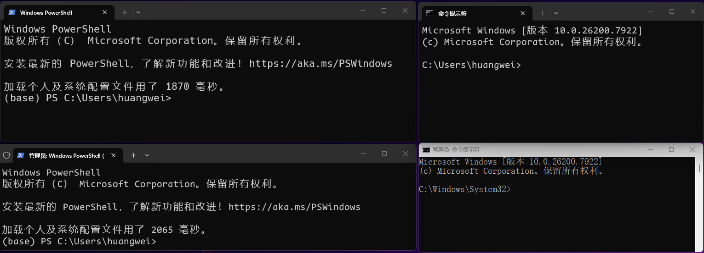
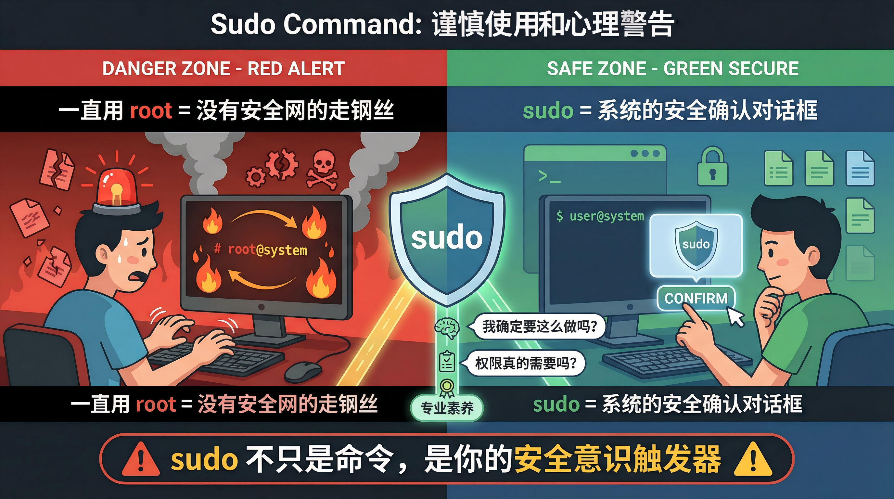

# Topic 1: 现代 Linux 开发环境

---

## 为什么是 Linux?

- **服务器事实标准**: 绝大多数互联网服务器运行 Linux
- **云原生基石**: Docker, Kubernetes, DevOps 工具链
- **AI 基础设施**: PyTorch, TensorFlow, CUDA 训练环境

---

## Linux 内核 vs 发行版

- **Kernel (内核)**: 操作系统的心脏 (由 Linus Torvalds 创立并维护主线版本，同时有全球成千上万的社区开发者、公司（如Red Hat、IBM、SUSE）参与贡献代码和维护特定发行版的分支
  - 负责硬件驱动、内存管理、进程调度
  - 查看版本: `uname -r`
- **Distribution (发行版)**: 内核 + GNU 工具 + 包管理器 + 桌面环境
  - **Debian 系**: Ubuntu, Kali (使用 `apt`, `.deb`)
  - **RedHat 系**: RHEL, CentOS, Fedora (使用 `dnf`/`yum`, `.rpm`)
  - **Arch 系**: Arch Linux, Manjaro (使用 `pacman`)
  - 查看版本: `cat /etc/os-release`

---

## 课程环境策略

| 环境 | 角色 | 典型用途 | 权限 |
| :--- | :--- | :--- | :--- |
| **WSL 2 (Ubuntu 22.04)** | **本地主战场** | 编码、测试、Docker 容器 | Root (sudo) |
| **共享服务器** | **远程演练场** | 模拟生产环境、长时任务、审计 | 普通用户 |
| **VirtualBox** | **兜底方案** | 兼容性测试、网络隔离实验 | Root |

---

## WSL 2: Windows Subsystem for Linux

> "在 Windows 上原生运行 Linux 二进制文件"

- **架构**: 轻量级虚拟机，深度集成 Windows 文件系统与网络
- **安装**: `wsl --install` (管理员 PowerShell)
- **优势**: 
  - 秒级启动
  - 与 VS Code 无缝集成
  - 直接调用 Windows 进程 (如 `explorer.exe .`)
  - **互操作性**: Linux 下通过 `/mnt/c/` 访问 Windows C 盘文件

---

## Windows 终端基础

> 工欲善其事，必先利其器

- **PowerShell vs CMD**:
  - **CMD (命令提示符)**: 古老遗留产物，功能受限，**不推荐使用**。
  - **PowerShell**: 现代 Windows 首选终端，支持别名与脚本。
- **输入法陷阱**:
  - **全角符号**: 中文输入法下的 `。` `－` 会导致命令报错。
  - **习惯**: 敲命令前**务必**切换为英文输入法。
- **路径分隔符**:
  - Windows: `C:\Windows\System32` (反斜杠 `\`, 邪道)
  - Linux/Web: `/home/user` (正斜杠 `/`, 正道)

---

## Windows Terminal vs PowerShell

> 很多初学者容易混淆这两个概念

- **Windows Terminal (终端)**: 
  - **角色**: 载体/容器 (就像浏览器 Chrome/Edge)
  - **功能**: 负责显示窗口、标签页、字体渲染、多窗口管理
  - **特点**: 可以同时打开 PowerShell, CMD, WSL (Ubuntu) 等多个标签页
- **PowerShell (Shell)**: 
  - **角色**: 解释器/引擎 (就像网页引擎 JavaScript)
  - **功能**: 负责解析你输入的命令并执行，返回结果
  - **关系**: Windows Terminal 运行着 PowerShell

---



---

## 权限管理: root vs user

> 权力越大，责任越大 (With great power comes great responsibility)

- **root (超级用户)**: 系统的神，拥有无限权力 (慎用!)。`id` 显示 `uid=0`。
- **普通用户**: 权限受限，日常操作默认身份。`id` 显示 `uid=1000+`。
- **进程视图**: `ps aux` 在本地 (WSL) 可见所有进程，在本课程搭建提供的共享服务器 (多用户) 仅可见自己进程。
- **提权机制**:
  - **`su <user>`**: 切换身份 (Switch User)。单独用 `su` 默认切到 root (需密码)
  - **`sudo <command>`**: 临时以 root 权限执行命令 (SuperUser DO)

---



---

## WSL 最佳实践: 权限篇

1. **默认用户**: 安装后初始化时，**务必**创建一个普通用户，不要直接用 root 登录
   - 避免误操作损坏系统文件
2. **最小权限原则**:
   - 日常开发 (编译、运行代码): **普通用户**
   - 系统管理 (安装软件、修改配置): **`sudo apt install ...`**
3. **设置默认用户** (如果误设为 root):
   - PowerShell: `ubuntu config --default-user <username>`

---

# Topic 2: SSH 远程连接艺术

---

## SSH (Secure Shell)

> 远程登录的安全标准

- **加密**: 所有传输数据（包括密码）均加密
- **认证**: 密码认证 vs **密钥认证** (推荐)
- **端口**: 默认 22

---

## 密钥认证原理

1. **生成密钥对**: `ssh-keygen -t ed25519 -C "your_email"`
   - 推荐 `ed25519`: 椭圆曲线算法，比 RSA 更安全且性能更好
   - 私钥 (`id_ed25519`): **绝对保密**，留在本地
   - 公钥 (`id_ed25519.pub`): **公开**，放到服务器
2. **分发公钥**: `ssh-copy-id user@host`
3. **连接**: 服务器发起挑战，客户端用私钥签名响应，服务器用公钥验签

---

## 高效 SSH 配置 (`~/.ssh/config`)

别再每次输入 `ssh user@192.168.1.100 -p 2222` 了！

```ssh
# ~/.ssh/config

Host lab-server
    HostName 192.168.1.100
    User student_01
    Port 2222
    IdentityFile ~/.ssh/id_ed25519

Host github.com
    User git
    IdentityFile ~/.ssh/id_ed25519_github
```

使用: `ssh lab-server`

---

## 端口转发 (Port Forwarding)

让内网服务“暴露”给本地。

- **本地转发 (-L)**: 访问本地端口 -> 远程服务器访问目标
  - `ssh -L 8080:localhost:80 lab-server`
  - 场景: 访问服务器上只监听 127.0.0.1 的 Web 服务
- **远程转发 (-R)**: 远程访问端口 -> 本地服务
  - 场景: 让外网服务器访问你本地调试的 API
