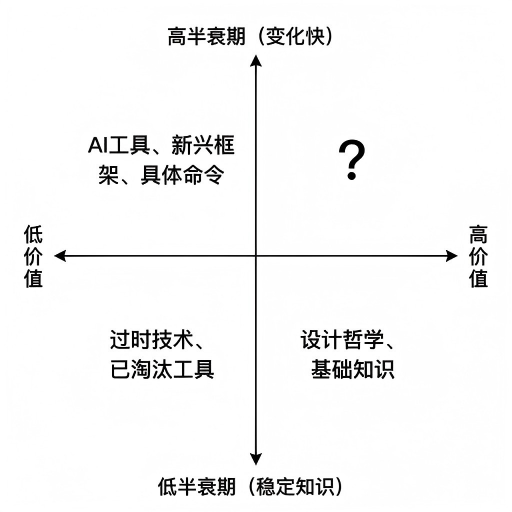

# Topic 1: AI 时代的学习方法论

---

## 技术的快速演进

**过去 10 年的变化**：

```
2015: Docker 兴起
2016: Kubernetes 问世
2017: AI AlphaGo 击败人类围棋冠军
2018: Serverless 开始流行
2019: Kubernetes 成为主流
2020: COVID 推动远程协作
2021: AI 编程助手爆发
2022: ChatGPT 横空出世
2023: AI Agent 开始实用化
2024: Claude Code 等 TUI 工具成熟
2025: Agent Teams 协作成为趋势
```

**核心问题**：技术变化这么快，学得完吗？

---

## 学习内容的分类

重要度矩阵



---

## 学习策略

- **高价值+低半衰期（核心）**：深入学习，重点掌握
- **高价值+高半衰期（前沿）**：理解原理，跟踪趋势
- **低价值+低半衰期（具体）**：用时再学，或用 AI 辅助

---

## 深度优先于广度

### 反例：广度优先

```
浅层学习 100 个工具
├── 知道每个工具的名字
├── 知道每个工具的基本用法
└── 但都不精通

问题：
1. 很快忘记
2. 无法组合使用
3. 无法解决复杂问题
```

---

## 正例：深度优先

```
深入学习 10 个工具
├── 理解工具的设计思想
├── 掌握工具的高级用法
└── 能够组合使用

优势：
1. 知识留存时间长
2. 可以迁移到类似工具
3. 可以解决复杂问题
```

---

## 实践原则

- **精通一门**：深入理解一个工具
- **触类旁通**：快速学习类似工具
- **建立模型**：形成思维模型和思维框架

---

## 可迁移能力

### 什么能力是可迁移的？

| 不可迁移 | 可迁移 |
|----------|--------|
| 具体命令 | 设计思想 |
| 工具语法 | 工作流程 |
| 配置细节 | 问题诊断方法 |
| 版本特性 | 学习方法 |

---

## 培养可迁移能力

1. **理解底层原理**：技术变了，原理不变
2. **建立思维模型**：新工具可以套用旧模型
3. **掌握学习方法**：新工具可以用相同方法学习

---

## 案例：技能迁移

```
从 Bash 到 Zsh
不可迁移：具体语法、内置命令
可迁移：脚本编写思维、调试方法

从 Docker 到 Podman
不可迁移：具体命令、参数
可迁移：容器化思想、镜像概念
```

---

# Topic 2: 官方文档阅读能力

---

## 为什么官方文档是最好的老师？

### 1. 权威性

```
官方文档 → 来自开发团队
第三方教程 → 可能有错误或过时
```

### 2. 及时性

```
官方文档 → 随软件更新
纸质书籍 → 出版即过时
视频教程 → 制作周期长
```

---

## 官方文档的优势（续）

### 3. 完整性

```
官方文档 → 覆盖所有功能
博客文章 → 只覆盖常用场景
```

### 4. 可验证性

```
官方文档 → 可以验证文档是否正确
他人经验 → 无法验证
```

---

## Linux 官方文档生态

### 核心文档

**man pages（命令行手册）**

在 Unit 01 的 Topic 5 "寻求帮助" 中，我们学习了：
- man 文档的基本结构和阅读技巧
- 如何高效地查找和理解命令文档
- man 的章节分类（用户命令、系统调用、库函数等）

**本单元重点**：培养自主查阅官方文档的能力和习惯

---

### 其他核心文档

```
info pages
├── info coreutils
└── info libc

文档目录
├── /usr/share/doc/
├── /usr/share/man/
└── 源代码中的 README
```

---

## 查找官方文档

```bash
# 查找命令文档
man cp

# 查找软件包文档
dpkg -L coreutils | less

# 查找配置文档
apropos "防火墙"

# 查找相关命令
man -k "copy file"
```

---

## 配置文件的官方文档

### 寻找配置参考

```bash
# 软件包文档目录
ls /usr/share/doc/

# 示例配置文件
ls /usr/share/doc/*/examples/

# 配置文件模板
ls /etc/*.default/
```

---

## 解读配置文件

```bash
# 查看配置文件
cat /etc/ssh/sshd_config

# 查找注释
grep -v "^#" /etc/ssh/sshd_config | grep -v "^$"

# 对比默认配置
diff /etc/ssh/sshd_config /usr/share/openssh/sshd_config.default
```

---

# Topic 3: AI 辅助学习实践

---

## AI 作为学习助手的定位

### AI 不该做什么

❌ **直接给出答案**

```
学生: "如何查看 CPU 使用率？"
AI: "使用 top 命令"

问题：跳过了思考过程，没有理解原理
```

---

## AI 该做什么

✅ **辅助理解和探索**

```
学生: "我想监控系统资源，应该用什么方法？"
AI: "Linux 提供了多种监控方法...
     你想监控哪个方面的资源？CPU、内存、磁盘还是网络？"

价值：引导学生思考需求，主动学习
```

---

## AI 辅助阅读官方文档

### 场景：理解复杂 man page

**挑战**：`iptables` 的 man page 有几千行

**不推荐的做法**：

```
"让 AI 解释 iptables 的所有参数"
```

---

## 推荐的做法

```
"我用 iptables 配置防火墙，
 请帮我理解下面这个 man page 中的 -j 参数：
[jump-target]
```

**为什么这样**：

- AI 帮助理解当前需要的内容
- 不跳过阅读原始文档的过程
- 保持学习的主动性

---

## AI 辅助代码理解

### 场景：理解复杂的 Shell 脚本

**脚本**：

```bash
find . -name "*.log" -mtime +7 -size +100M -delete
```

**自己先分析**：

- `find`: 查找文件
- `-name "*.log"`：文件名模式
- `-mtime +7`：修改时间 7 天前
- `-size +100M`：文件大小 100MB+
- `-delete`：删除

---

## 遇到问题时问 AI

```
"find 命令的 +7 和 +100M 前面可以加负号吗？
 请解释这些参数的精确含义。"
```

**验证 AI 的回答**：

- 查看官方文档验证
- 自己测试验证

---

## AI 辅助生成学习计划

### 场景：学习 Nginx

**不推荐**：

```
"教我 Nginx 的所有功能"
```

---

## 推荐的做法

```
"我想学习 Nginx 用于反向代理，
请帮我制定一个 2 小时的学习计划。

我的基础：
- 已掌握 Linux 基础命令
- 了解 HTTP 协议基本概念
- 做过简单的 Web 服务器配置

请给出：
1. 学习目标和里程碑
2. 推荐的学习资源
3. 实践练习建议"
```

---

# Topic 4: 持续学习资源和方法

---

## Linux 生态的核心资源

### 1. 官方文档

```
Linux 内核
├── 源代码 (kernel.org)
├── 文档 (kernel.org/doc)
└── 邮件列表 (LKML)

软件包
├── Debian/Ubuntu
├── Red Hat/CentOS
└── Arch Linux
```

---

### 2. 源代码

**为什么阅读源代码**：

- 了解工具的真实实现
- 学习优秀的编程风格
- 调试时可以查看实现

**适合阅读的源代码**：

- `coreutils`：基础工具（ls, cat, cp）
- `util-linux`：高级工具（lsblk, mount）
- `busybox`：嵌入式工具（精简实现）

---

### 3. 邮件列表和社区

**重要邮件列表**：

- LKML（Linux Kernel Mailing List）
- 发行版邮件列表
- 项目特定邮件列表

**社区参与**：

- 报告 Bug
- 提交 Patch
- 参与讨论

---

## 跟上技术发展的方法

### 1. 关注核心资源

**官方渠道**：

- 官方博客
- Release Notes（changelog）
- 官方文档更新

**社区渠道**：

- Reddit (r/linux, r/docker)
- Hacker News
- Twitter/X 技术博主

---

### 2. 过滤信息噪音

**信息筛选原则**：

- 优先关注官方信息
- 警惕"营销号"和过度宣传
- 验证信息的准确性

---

### 3. 实验新技术

**安全实验方法**：

```bash
# 在隔离环境中实验
docker run -it ubuntu bash

# 使用 UTM/Parallels 等虚拟机
# 使用云服务器（可快照恢复）
```

---

## 建立个人知识管理系统

```
┌──────────────────────
│         个人知识库  
├──────────────────────
│  笔记和文档          
│  ├─ 学习笔记         
│  ├─ 问题记录        
│  └─ 解决方案         
│                     
│  工具和模板        
│  ├─ 常用命令      
│  ├─ 脚本模板       
│  └─ 配置模板      
│                  
│  资源链接       
│  ├─ 官方文档   
│  ├─ 优质博客  
│  └─ 开源项目 
```

---

# Topic 5: 案例分析

---

## 案例 1：从 Docker 到 Podman

### 学习新工具的方法

**第一步：理解原理**

- Docker 和 Podman 有什么不同？
- 对比学习效率更高

---

## 第二步：看官方文档

- Podman 官方文档：docs.podman.io
- 重点看"Compatibility"章节

---

## 第三步：实践对比

```bash
# Docker 习惯命令
docker run -d nginx

# Podman 等效命令
podman run -d nginx

# 区别很小，主要是 CLI 略有差异
```

---

## 第四步：建立映射

- 命令 → 核心概念不变
- 工具差异 → CLI 细节
- 底层实现 → Podman 是无守护进程

---

## 案例 2：从 SysVinit 到 systemd

### 理解变化的核心

```
SysVinit (老)
├── 启动脚本 (/etc/init.d/)
├── 运行级别 (/etc/rc*.d/)
└── 进程管理 (init 脚本)

systemd (新)
├── 单元文件 (*.service)
├── 目标依赖 (Wants/After)
└── 并行启动
```

---

## 学习策略

1. 理解设计理念的变化
2. 掌握核心命令 (`systemctl`)
3. 理解单元文件的语法
4. 不需要记住所有细节

---

## 案例 3：AI 时代的技能迭代

### 技能的半衰期

```
第 1 层：具体工具（1-2 年）
├── 具体的命令
├── 特定的框架
└── 当前的版本

第 2 层：基础技能（5-10 年）
├── 文本处理能力
├── 系统思维
└── 问题诊断能力

第 3 层：核心能力（20 年+）
├── 学习能力
├── 适应能力
└── 思维模型
```

---

## 投资策略

- 70% 投入第 2、3 层
- 30% 跟踪第 1 层
- 用 AI 辅助缩短第 1 层的学习时间

---

# 总结

---

## 本单元要点

**学习优先级**：深度 > 广度，基础 > 前沿

**官方文档**：最好的学习资源

**AI 辅助**：加速理解，不跳过思考

**持续学习**：建立知识系统，关注核心资源

---

## 能力提升

- ✅ 理解 Linux 设计哲学和最佳实践
- ✅ 掌握官方文档阅读方法
- ✅ 学会用 AI 辅助学习
- ✅ 建立持续学习的方法和习惯

---

## 下一个课题

面对任何新技术，都能快速上手

---

## 参考资源

- 《The Art of Unix Programming》
- 《The Linux Programming Interface》
- Linux 内核文档：https://www.kernel.org/doc/html/latest/
- Arch Wiki：https://wiki.archlinux.org/
